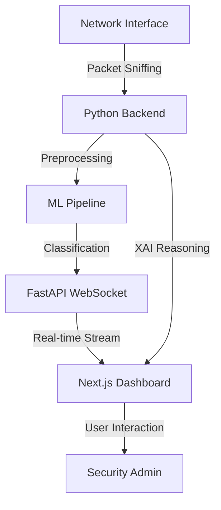

# 🛡️ Sentinel-NIDS: Advanced Network Intrusion Detection System

[](https://nextjs.org/)
[](https://fastapi.tiangolo.com/)
[](https://www.tensorflow.org/)
[](https://tailwindcss.com/)

Sentinel-NIDS is a state-of-the-art, full-stack cybersecurity platform designed to monitor, detect, and analyze network intrusion attempts in real-time. By leveraging deep learning architectures and high-fidelity visualizations, it provides security administrators with actionable intelligence and forensic depth.

---

## ✨ Core Features

| Feature | Description |
| :--- | :--- |
| **🚀 Real-Time Traffic Hub** | Live network capture and instant classification of incoming packets. |
| **🧠 Neural Detection Engine** | Multi-stage pipeline using Autoencoders and Classifiers (FastAPI-powered). |
| **🔍 Explainable AI (XAI)** | Transparent reasoning for every detection, highlighting critical features. |
| **📜 Forensic Timeline** | High-fidelity vertical timelines for high-severity incident investigation. |
| **🏗️ Captured Analysis** | Ability to upload and analyze historical network datasets (CSV/PCAP). |
| **🛡️ Sentinel Protocols** | Integrated RBAC simulations and administrative security governance. |

---

## 🏗️ Project Architecture



### Module Breakdown
- **`/frontend`**: Next.js 15+ dashboard featuring Framer Motion animations and Chart.js analytics.
- **`/backend`**: High-performance Python server implementing the NIDS three-stage pipeline.
- **`/live_nids_hotspot`**: Specialized scripts for sniffing and capturing hotspot traffic.

---

## 🚦 Quick Start

### 1. Prerequisites
- Node.js 20+
- Python 3.10+
- `pip` and `npm`

### 2. Backend Initialization
```bash
cd backend
pip install -r requirements.txt
python main.py
```
*Server runs on: [http://localhost:8000](http://localhost:8000)*

### 3. Frontend Initialization
```bash
cd frontend
npm install
npm run dev
```
*Dashboard runs on: [http://localhost:3000](http://localhost:3000)*

---

## 🧪 Advanced Tools (Backend)
The system includes specialized utility scripts for research and debugging:
- `generate_sample.py`: Creates mock network traffic for testing.
- `inspect_models.py`: Analyzes the layer weights and performance of the trained neural networks.
- `nids_three_stage_pipeline.py`: The core logic for the integrated detection flow.
- `get_features.py`: Extracts critical features from raw network packets.

---

## 🛡️ License & Ethics
This project is for **academic and research purposes only**. It demonstrates the effectiveness of hybrid ML architectures in network security. Ensure appropriate permissions before monitoring any network that is not your own.

**Built with ❤️ by the Sentinel Team · 2026**
